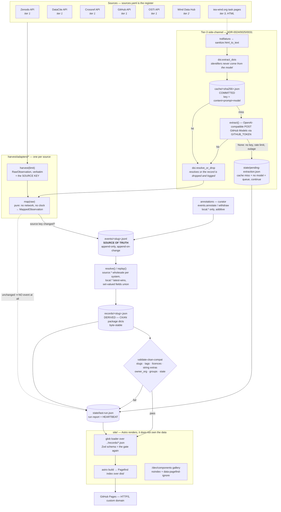
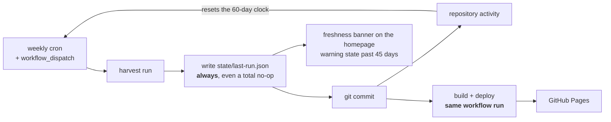

# Architecture

The whole system, end to end. Source of authority: `plans/02-static-plan.md`
§§3–4, and `harvest/CONTRACT.md` for the interfaces. Where this page and the
code disagree, the code is right and this page is a bug.

See [[index]] for the vault map, [[record-format]] for the shapes.

---

## 1. In one paragraph

Nobody who has already published a fully-described dataset to Zenodo will log
into a second system to describe it again. So the catalogue asks nothing of
anyone ([[adr-0020-aggregation-only]]): a scheduled job watches the places
where IEA Wind people already publish, records what it finds as an append-only
event log, materialises that log into CKAN-shaped JSON records, validates them
against what CKAN's API would accept, and renders them as a static site with a
build-time search index. There is no database, no server, no login and no
billing account. The repository *is* the system.

---

## 2. The pipeline

Read the arrows that go *backwards* as carefully as the ones that go forwards:
an unchanged source key writes nothing to `events/` but is still counted in
`state/last-run.json`; a validation failure is reported rather than silently
skipped; and the run report feeds the site so that staleness is visible to a
visitor rather than only to a CI dashboard.

### 2.1 The stages, named

| Stage | Entry point | Writes | Notes |
|---|---|---|---|
| harvest | `Adapter.harvest(limit)` | nothing | verbatim `RawObservation`s, at most `limit` |
| map | `Adapter.map(raw)` | nothing | pure; this is what fixture tests call, offline |
| change detection | `harvest.events.has_changed` | nothing | [[adr-0026-change-detection-by-source-key]] |
| append | `harvest.events.record_scrape` | `events/<slug>.jsonl` | append-only, append-on-change |
| annotate | `harvest.events.annotate` / `withdraw` | `events/<slug>.jsonl` | `local.*` only |
| replay annotations | `harvest.annotations.apply_annotations` | `events/<slug>.jsonl` | `annotations/*.yaml` → `annotated` events, idempotently; part of `run` and `materialize` |
| check pins | `harvest.annotations.check_pins` | `events/<slug>.jsonl` | one `pin_notice` per observed source key when a pinned page moves (§4.3) |
| resolve | `harvest.events.resolve` | nothing | folds a log into a `ResolvedRecord` |
| materialise | `harvest.materialize.materialize_all` | `records/<slug>.json` | byte-stable; prunes orphans |
| validate | `harvest.ckan_compat.validate_records` | nothing | prints **every** violation, not the first |
| report | `harvest.runreport.RunReport.write` | `state/last-run.json` | **written every run, always** |
| render | `astro build` + `pagefind` | `site/dist/` | records load via glob |

`uv run python -m harvest run` performs harvest → change detection → append →
replay `annotations/` → check pins → materialise → validate → report in one
pass. See [[run-a-harvest-locally]].

Two stages are deliberately **not** in that pass, and are separate verbs:
`harvest dedupe` writes merge decisions into the log, and `harvest linkcheck`
talks to every upstream a record points at. Neither belongs in an unattended
weekly job without being asked for — `run --linkcheck` opts in. Both write to
`state/` (`merge-proposals.json`, `link-check.json`) and to the run report's
`notices`; neither ever edits `records/`. See [[correct-a-record]] §6 and §7.

---

## 3. Identity, slugs and URLs

One string ties the whole system together. `harvest.identity.identity_key`
derives it, strictly in preference order — DOI, then `source_system|source_id`,
then a documented-as-fragile hash of title + first-author surname + year.
`harvest.identity.slug_for_identity` renders it once, and that one slug is
simultaneously:

- the CKAN `package.name`,
- `records/<slug>.json`,
- `events/<slug>.jsonl`,
- the site URL `/record/<slug>/`.

The slug depends on the identity key **and nothing else** — never on the title
— which is what makes record URLs citable across a retitle. Full rules and the
collision behaviour are in [[record-format]].

---

## 4. The Tier-3 side-channel

Tier 1 is deterministic and carries the majority of records. It never involves
a model ([[adr-0024-the-llm-boundary]]). The heterogeneous HTML of the task
microsites is the only place a model earns its keep, and it is fenced in on
four sides:

1. **Clean text in, never raw HTML.** `trafilatura` for main content, then
   `harvest.sanitize.html_to_text`. This cuts tokens by roughly an order of
   magnitude, improves accuracy, and is also the prompt-injection boundary —
   a harvested page is hostile input to a system that then writes records.
2. **Identifiers never come from the model.** `harvest.doi.extract_dois`
   regexes them out deterministically; the model is asked to *assign* them;
   `harvest.doi.resolve_or_drop` then resolves every one against DataCite or
   Crossref. A DOI that does not resolve means the record is dropped and
   logged. Hallucinated identifiers become structurally impossible rather than
   merely unlikely.
3. **Extraction, not generation.** Titles and abstracts are copied, never
   summarised, which is what makes two model lineages an auditable footnote
   instead of a quality problem.
4. **The cache is committed** ([[adr-0025-the-extraction-cache-is-committed]]).
   `cache/<sha256(content + prompt_version + model_id)>.json`. A rebuild
   replays the cache rather than re-inferring, which is the only reason
   "rebuild from the repo" and "AI harvester" are not in direct conflict.

If the model is unavailable for any reason — no token, rate limit, outage,
schema-validation failure — `extract()` returns `None`, the page is appended to
`state/pending-extraction.json`, and the run continues and succeeds
([[adr-0031-the-harvest-never-fails-on-llm-unavailability]]). Someone drains
the queue later, or never: see
[[drain-the-pending-extraction-queue]].

---

## 5. The heartbeat and the dormancy loop

GitHub disables scheduled workflows after 60 days with no repository activity,
and **only commits count** — tags, releases, issues and merged PRs do not.

Three consequences that bite people:

- **`state/last-run.json` is written on every run, including a complete no-op
  and including a failed one.** That is the entire keepalive. It is implemented
  inline rather than by adding a Marketplace keepalive action, because an
  action running in a workflow with repo write permissions is a supply-chain
  risk not worth taking for three lines of code.
- **Pushes made with `GITHUB_TOKEN` deliberately do not trigger further
  workflows**, so build and deploy must live in the *same* workflow run as the
  harvest, not in a separate workflow listening for the commit.
- **Staleness is surfaced on the site, not in the Actions tab.** Nobody checks
  a CI dashboard for a dormant project. See
  [[adr-0029-scheduling-and-the-heartbeat-commit]] and
  [[re-enable-a-dormant-cron]].

---

## 6. Trust boundaries

| Boundary | What crosses it | Control |
|---|---|---|
| upstream API → adapter | JSON | `HarvestClient`: robots-aware, throttled, conditional GET, never raises |
| upstream HTML → model | cleaned text | `trafilatura` then `sanitize.html_to_text`; the page is untrusted input |
| model → record | structured JSON | JSON-schema-constrained, pydantic-validated on receipt |
| model → identifiers | **nothing** | identifiers are regexed, then resolved against a registry |
| curator → record | `local.*` only | `source.*` is never editable ([[adr-0038-source-metadata-is-never-updated-only-annotated]]) |
| repo → the world | static HTML + JSON | no runtime, no user input, no write API |

The catalogue holds **metadata and links only**. It never mirrors a file. If
you find yourself writing bytes from a resource URL to disk, stop.

---

## 7. Binding invariants

Reproduced verbatim from `CLAUDE.md`. These are not guidance.

- **Records are CKAN `package` dicts.** `records/*.json` must always pass the CKAN-compat validation gate (slugs, tags, licence ids, string extras). CKAN promotion must stay a one-day job.
- **`events/` is the source of truth; `records/` is derived** and regenerable by replay. Append-only, append-on-change, ordered by observation time.
- **Source metadata is never edited, only annotated** (ADR-0038). `source.*` verbatim from upstream; `local.*` additive (tasks, notes, links, suppression, Tier-3 pins). Scalar collisions: source displaces + notice. Set-valued (`iea_task`): union.
- **Change detection = per-adapter source key** (ADR-0026); fallback is a normalised payload hash.
- **No identifier a model produced is ever accepted.** Every DOI resolves against DataCite/Crossref or the record is dropped and logged.
- **The harvest never fails because the LLM is unavailable.** Tier 1 is deterministic; Tier-3 misses queue to `state/pending-extraction.json`.
- **LLM in CI = GitHub Models via `GITHUB_TOKEN` (`permissions: models: read`).** No vendor SDK — OpenAI-compatible HTTP only (ADR-0035). Extraction cache is committed; cache key = hash(content + prompt_version + model_id).
  *Status, 2026-09-01: GitHub Models is in a scheduled retirement brownout and answers `410 Gone`, so this route is configured but not currently exercisable. Nothing breaks — the invariant above it is what carries the system, and the run degrades to the pending queue. The operative path is `$HARVEST_LLM_ENDPOINT`; see [[adr-0030-llm-access-via-github-models]] §Status.*
- **Every run commits** (`state/last-run.json` heartbeat) — this keeps the cron alive past GitHub's 60-day dormancy rule. Build+deploy live in the same workflow as the harvest.
- **Pinned everything, no auto-updates** (ADR-0034): `.python-version` + `uv.lock` (`uv sync --frozen`); pinned Node + `package-lock.json` (`npm ci`); pinned runner image (`ubuntu-24.04`, never `-latest`). Python direct deps capped at four: `httpx`, `trafilatura`, `pydantic`, `pyyaml`.
- **Astro renders; it doesn't own the data.** Records load via glob; no framework fields in the record format. Astro components for content; vanilla custom elements only for interactivity; `/dev/components` gallery (real records + pathological fixtures) instead of Storybook.
- **Design: colour never fills a surface.** Neutral backgrounds only; semantic colour appears as text, icons, outline badges, focus, and 3px square-cornered left accent bars. Components consume tokens with zero hardcoded values (CI grep enforces). WCAG 2.2 AA is a build gate: pa11y-ci over the gallery and key pages, both themes.
- **Withdrawn records are kept, never deleted.**

---

## 8. What is built, and what is not

**Every track has landed.** As of this commit there are no stubs left in
`harvest/adapters/`, no `SPEC — not yet implemented` command in the runbooks,
and the pipeline has been run end to end against the live upstreams. `uv run
pytest` is green.

The foundation: `harvest/models.py`, `identity.py`, `doi.py`, `licenses.py`,
`sanitize.py`, `http.py`, `events.py`, `materialize.py`, `ckan_compat.py`,
`config.py`, `runreport.py`, `cli.py`, the adapter base and registry, the three
YAML registers, `schema/ckan-scheming.json`, the `Makefile` and
`harvest/CONTRACT.md`.

| Built | Owner | The evidence it is done |
|---|---|---|
| the seven adapters' `harvest()` / `map()` — `zenodo`, `datacite`, `crossref`, `github`, `osti`, `ieawind`, `wdh` | tracks A–G | `uv run python -m harvest run` reports `implemented: true` for every source; each has its own `tests/test_<name>.py` and its fixture family |
| Tier-3 extraction, committed cache, pending queue — `harvest/extract.py` | track H | `uv run python -m harvest extract` exits 0 and prints `extract: resolved N pending extraction(s)`; the committed `cache/` entries replay offline |
| reconciliation, merges, link checking, `annotations/` replay — `harvest/dedupe.py`, `harvest/annotations.py`, `harvest/linkcheck.py`, the `dedupe` / `linkcheck` / `annotations` verbs | track I | `uv run python -m harvest dedupe` and `linkcheck` exit 0; notices appear in `state/last-run.json` |
| `site/` — Astro, Pagefind, the gallery, the a11y gate | track J | `make site` and `make gates` succeed |
| `.github/workflows/` | CI track | `catalogue.yml` and `ci.yml` are present; their YAML parses and every command they invoke exists in the `Makefile` or the `harvest` CLI, cross-checked command by command. **They have never executed** — a workflow cannot be run locally and neither has been pushed, so the first real run is the first proof. `catalogue.yml` is the file that will commit `state/last-run.json` weekly and deploy in the same job |

What remains is not a track but a **recorded gap**: publication lists that live
only inside a linked PDF are out of scope for v1 and are reported as a coverage
notice rather than crawled (fixture `iea-11-pdf-only`), and the Wind Data Hub
disables itself behind its authentication wall rather than guessing (fixture
`wdh-07`). Neither is a bug; both are visible in the run report.
